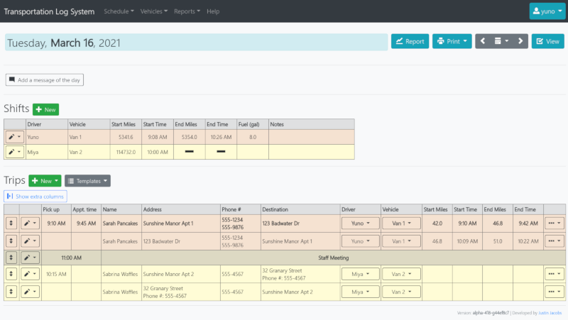

# Transit Log System

The Transit Log System (TLS) is a web-based application that can be used to log and report usage data for bus/shuttle transportation programs. It was specifically built and designed for the Stow, MA Council on Aging, but it should be flexible enough to apply elsewhere.

## Features

- Easy to use schedule with templates and other quality-of-life features, such as quickly being able to create return trips
- A "driver" view of the schedule designed for mobile devices used out in the field
- Customizable reports that summarize a variety of data points, such as vehicle milage and collected fares
- The ability to keep track of vehicle maintainence information and report any issues during pre-trip inspection
- Management of frequently used information, including: clients, destinations, fares, and trip tags
- A powerful search tool
- User management with three levels of permissions

## Installation

TLS is written with the Django framework, and also uses openpyxl for exporting Microsoft Excel files. Both can be installed with pip:

    pip install Django
    pip install openpyxl

The basic installation is the same as any other Django app. The initial setup depends on your choice of web server, but the most common method is to use [nginx and uWSGI](https://uwsgi-docs.readthedocs.io/en/latest/tutorials/Django_and_nginx.html).

I like to define some environment variables for site-specific things, so this project looks for:

    DJANGO_DEBUG
    DJANGO_ALLOWED_HOST
    DJANGO_SECRET_KEY

- Set `DJANGO_DEBUG` to `True` when working in a development environment
- Set `DJANGO_ALLOWED_HOST` to your domain name
- Set `DJANGO_SECRET_KEY` to your site's secret key

Also, TLS uses the Django [sessions middleware](https://docs.djangoproject.com/en/3.1/topics/http/sessions/), so it is recommended to have a scheduled task run that executes `manage.py clearsessions`.

## Copyright and License

The Transit Log System is Copyright ©2019-2021 Justin Jacobs, and is released under GPL version 3 or later. See COPYING for the entire license text.

